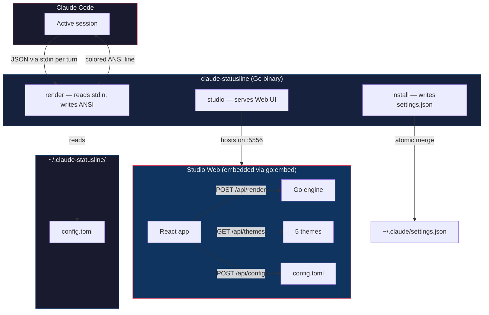
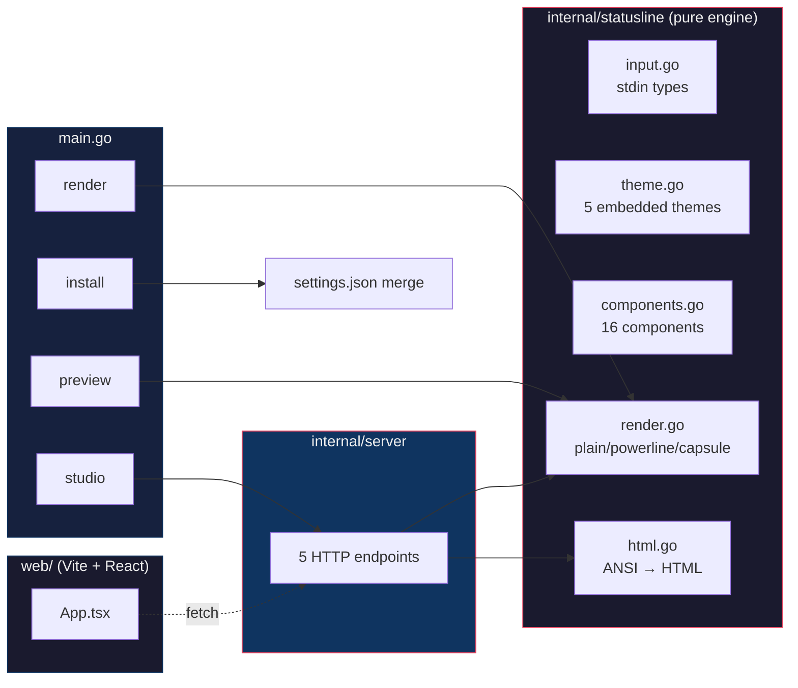

<!-- English version. Switch to Portuguese: README.md -->

> **[Português](README.md)** | English

<div align="center">

# claude-statusline

**A custom statusline for Claude Code with a visual editor in the browser.**

[](https://go.dev)
[](https://github.com/Felipeness/claude-statusline/releases)
[](#stack-)
[](#-studio)

**16 components** &bull; **5 themes** &bull; **3 styles** &bull; **15 combinations** &bull; **0 runtime deps**

*Inspired by [Powerline Studio](https://powerline.owloops.com/) — ported to Claude Code.*

</div>

---

## ~ Why this exists

**Problem.** Claude Code's default statusline shows `branch · model · mode` and that's it. Alternatives (ccstatusline, claude-powerline) give you more, but configuring them is a nested-JSON dance.

**Insight.** Statusline configuration is a visual problem, not a text problem. You need to *see* how each combination looks before saving.

**Solution.** A single Go binary that does two things: renders the statusline for Claude Code via stdin (fast, ~30ms) and opens a Studio in the browser (`claude-statusline studio`) where you drag components, pick themes, tune thresholds, and see the live preview with mock data you can adjust via sliders.

**Proof.** 16 components · 5 themes · 3 styles = 240 configurable combinations without editing TOML. One render engine in Go (same code in the terminal and the web preview — zero divergence risk). 11MB binary, zero runtime dependencies.

---

## ~ Table of Contents

1. [Not Just "Another Statusline With a Pretty Face"](#-not-just-another-statusline-with-a-pretty-face)
2. [How it works](#-how-it-works)
3. [Available components](#-available-components)
4. [Studio](#-studio)
5. [Architecture](#-architecture)
6. [Project structure](#-project-structure)
7. [Quick Start](#-quick-start)
8. [Severity & thresholds](#-severity--thresholds)
9. [Optional history daemon](#-optional-history-daemon)
10. [Stack](#stack-)
11. [Privacy](#-privacy)
12. [License](#-license)

---

## ~ Not Just "Another Statusline With a Pretty Face"

| Dimension | ccstatusline | claude-powerline | cc-statusline | **claude-statusline** |
|---|---|---|---|---|
| **Visual editor** | ❌ JSON editing | ✅ Studio in separate repo | interactive CLI wizard | ✅ Studio embedded in binary |
| **Drag-and-drop** | ❌ | ✅ | ❌ | ✅ via @dnd-kit |
| **Threshold editor** | ❌ | partial | ❌ | ✅ per-component, with documented defaults |
| **Mock data sliders** | ❌ | ✅ | ❌ | ✅ live preview with 13 sliders |
| **Single binary** | ✅ Node | ✅ Node | bash + jq | ✅ pure Go |
| **Runtime deps** | npm | npm | jq, bash | **zero** |
| **JS↔native engine duplication** | n/a | yes (ported to browser) | n/a | **no — Go renders, frontend just displays** |
| **Themes** | 1 | 6 | varies | 5 (graphite, nord, dracula, sakura, mono) |
| **Styles** | plain | powerline, minimal, capsule | varies | plain, powerline, capsule |

The only genuine advantage of Node-based competitors is the npm ecosystem — for a statusline, that's overhead, not an advantage.

---

## ~ How it works



On every Claude Code turn, `render` receives a JSON with `cwd`, `model`, `cost`, `context_window`, `rate_limits`, `worktree`, etc. It applies your TOML config, generates a colored ANSI line, and returns it via stdout. The Studio is the same binary running in HTTP mode — it grabs the config, POSTs `{config, mock_input}` to `/api/render`, and shows the result.

---

## ~ Available components

<details>
<summary><strong>16 components organized in 7 categories</strong></summary>

| Component | Category | Shows |
|---|---|---|
| `cwd` | path | Current path shortened with `~` |
| `git` | git | Branch + dirty marker (`✱`) + ahead/behind (`↑1↓2`) |
| `ticket` | git | Auto-extracts `TICKET-NNNN` from branch name (Jira/Linear) |
| `lines_changed` | git | `+45/-12` lines |
| `model` | model | Display name (e.g., "Opus 4.7") |
| `vim_mode` | system | NORMAL / INSERT |
| `context_pct` | context | Bar `▓▓░░░░ 42%` with severity color |
| `cost_session` | cost | `$X.XX` with optional `(N×p90)` badge |
| `burn_rate` | cost | Tokens/min with rising arrow `⬆` |
| `cost_today` | cost | Today's accumulated cost (needs daemon) |
| `cost_month` | cost | Monthly total + projection (needs daemon) |
| `rate_5h` | limits | Bar + % of 5h block + countdown |
| `rate_7d` | limits | Bar + % of 7-day block + countdown |
| **`session_block`** | limits | **Large bar + prominent reset for the 5h block:** `session ▓▓▓▓▓░░░ 73% → 2h12m` |
| `cluster` | history | AI cluster label for the session (needs daemon) |
| `time` | system | `hh:mm` |

`session_block` is designed for Claude Pro/Max users — it highlights the 5-hour billing block as a primary line element (larger bar, "session" prefix instead of "5h", arrow `→` on the countdown).

</details>

---

## ~ Studio

```bash
claude-statusline studio    # opens http://localhost:5556 in your browser
```

| Panel | What it does |
|---|---|
| **Theme picker** | 5 cards with sample text + 3 ok/warn/crit indicators |
| **Style picker** | plain / powerline / capsule (powerline and capsule need a Nerd Font) |
| **Lines** | Horizontal drag-and-drop chips, multi-line with custom separator |
| **Threshold editor** | Click `⚙` on any chip with `has_warn_at` to tune warn/critical |
| **Mock data** | 13 sliders to simulate scenarios (context %, cost, burn rate, rate 5h/7d, etc) |
| **Reset preset** | compact / max / powerline |
| **Catalog** | Lists all 16 components with "needs daemon" badge for history-dependent ones |

Saving persists to `~/.claude-statusline/config.toml`. Restart Claude Code to apply (statusLine only loads on boot).

---

## ~ Architecture



**Single source of truth**: the render engine lives 100% in Go (`internal/statusline/`). The Studio web doesn't duplicate anything — it just sends `{config, mock_input, mock_history}` via POST and displays the HTML the Go side returns (ANSI→HTML conversion is also in Go, in `html.go`). What you see in the preview is exactly what Claude Code sees.

---

## ~ Project structure

```
claude-statusline/
├── main.go                       # 4 CLI subcommands
├── embed.go                      # //go:embed all:web/dist
├── internal/
│   ├── statusline/
│   │   ├── input.go              # stdin JSON shape
│   │   ├── config.go             # TOML config + defaults + load/save
│   │   ├── theme.go              # 5 embedded themes
│   │   ├── ansi.go               # truecolor helpers
│   │   ├── components.go         # 16 components with metadata
│   │   ├── render.go             # plain/powerline/capsule renderers
│   │   ├── html.go               # ANSI → HTML for the Studio
│   │   ├── history.go            # optional daemon fetch
│   │   ├── presets.go            # compact/max/powerline
│   │   └── install.go            # atomic settings.json merge
│   └── server/
│       └── server.go             # 5 endpoints powering the Studio
└── web/                          # Vite + React 19 + Tailwind v4
    └── src/
        ├── App.tsx               # the entire Studio
        ├── api.ts
        ├── types.ts
        └── styles.css
```

---

## ~ Quick Start

**Prerequisites**: Go 1.26+, [Bun](https://bun.sh) (frontend build, once).

```bash
# 1. Clone + build
git clone https://github.com/Felipeness/claude-statusline ~/.local/src/claude-statusline
cd ~/.local/src/claude-statusline
cd web && bun install && bun run build && cd ..
go build -o ~/.local/bin/claude-statusline .

# 2. Plug into Claude Code (backups settings.json automatically)
claude-statusline install --preset compact
# if you already have another statusline: --force

# 3. Restart Claude Code (statusLine only loads on boot)
```

After that, you'll see a line like:
```
~/Desktop/Projects/my-app  feat/CC-1234✱  Opus 4.7  ▓▓░░░░ 42%  $0.32
```

To customize visually: `claude-statusline studio` opens http://localhost:5556. To see all 15 styles in the terminal: `claude-statusline preview --all`.

---

## ~ Severity & thresholds

Components with `has_warn_at: true` change color based on value:

| Severity | Color | When |
|---|---|---|
| **OK** | green | `value < warn_at` |
| **Warn** | amber | `warn_at ≤ value < critical_at` |
| **Crit** | red | `value ≥ critical_at` |

<details>
<summary><strong>Defaults (configurable in Studio via ⚙)</strong></summary>

| Component | warn_at | critical_at | Unit |
|---|---|---|---|
| `context_pct` | 50 | 80 | % of context window |
| `cost_session` | 0.8 | 1.2 | multiplier of historical p90 (needs daemon) |
| `burn_rate` | 1500 | 3000 | tokens/min |
| `rate_5h` | 70 | 90 | % of 5h block |
| `rate_7d` | 70 | 90 | % of 7-day block |
| `session_block` | 70 | 90 | % of 5h block |

</details>

---

## ~ Optional history daemon

Some components depend on cross-session history (`cost_today`, `cost_month`, `cluster`, the `(N×p90)` badge on `cost_session`, ranked `burn_rate`). We support [`claude-history`](https://github.com/Felipeness/claude-history) as a sidecar:

```toml
# ~/.claude-statusline/config.toml
[history]
endpoint = "http://localhost:5555"
timeout = "80ms"
```

Without a daemon, those components are hidden (graceful fallback) — everything else (cwd, git, model, context %, cost session, rate limits, session_block) works from stdin alone.

---

## Stack ~

**Backend**: Go 1.26 stdlib + [BurntSushi/toml](https://github.com/BurntSushi/toml). Nothing else.

**Frontend**: [Vite 8](https://vite.dev) + [React 19](https://react.dev) + [Tailwind v4](https://tailwindcss.com) + [@dnd-kit](https://dndkit.com/) (drag-and-drop with TS-native types).

The frontend build is embedded via `//go:embed all:web/dist` — shipped as a single binary.

---

## ~ Privacy

Runs 100% local. The Studio binds to `127.0.0.1:5556` by default. The `render` reads stdin from Claude Code, optionally GETs a local daemon, returns ANSI. Nothing leaves your machine.

---

## ~ License

TBD — personal project, source open for reading and learning.

---

<div align="center">

Spin-off of [`claude-history`](https://github.com/Felipeness/claude-history). Inspired by [Powerline Studio](https://powerline.owloops.com/), [ccstatusline](https://github.com/sirmalloc/ccstatusline), [claude-powerline](https://github.com/Owloops/claude-powerline).

</div>
