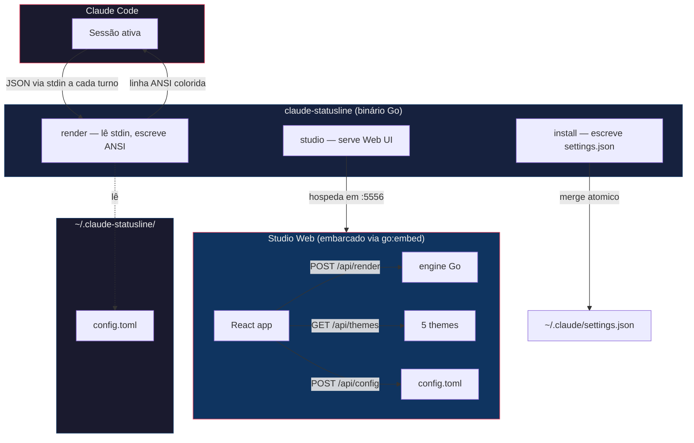
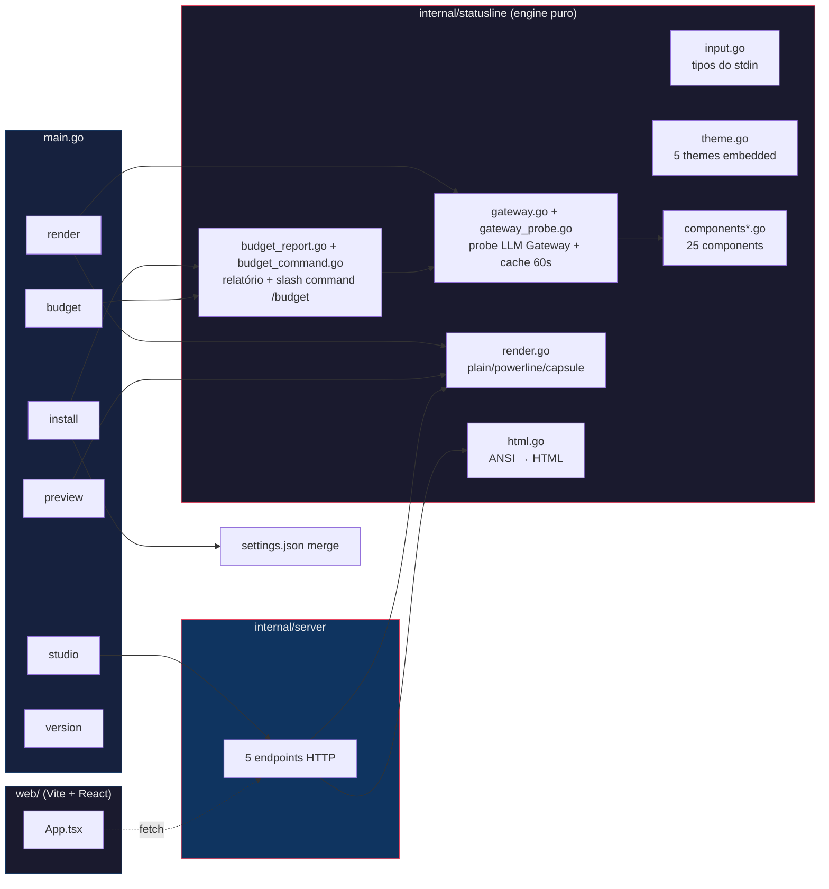

<!-- Portuguese (pt-BR) version. Switch to English: README.en.md -->

> Português | **[English](README.en.md)**

<div align="center">

# claude-statusline

**Statusline customizado pro Claude Code com editor visual no navegador.**

[](https://go.dev)
[](https://github.com/Felipeness/claude-statusline/releases)
[](#stack-)
[](#studio-)

**25 components** &bull; **5 themes** &bull; **3 styles** &bull; **4 presets** &bull; **0 deps em runtime**

*Inspirado no [Powerline Studio](https://powerline.owloops.com/) — portado pra Claude Code.*

</div>

---

## ~ Por que existe

**Problema.** O statusline default do Claude Code mostra `branch · model · mode` e fim. Os tools alternativos (ccstatusline, claude-powerline) dão mais, mas configurar é dança de JSON aninhado e tentativa-e-erro.

**Insight.** A configuração do statusline é um problema visual, não de texto. Você precisa **ver** como cada combinação fica antes de gravar.

**Solução.** Um binário Go único que faz duas coisas: renderiza o statusline pro Claude Code via stdin (rápido, ~30ms) e abre um Studio web (`claude-statusline studio`) onde você arrasta components, escolhe tema, ajusta thresholds e vê o preview live com dados mockados ajustáveis em sliders.

**Prova.** 25 components · 5 themes · 3 styles = 375 combinações configuráveis sem editar TOML, mais 4 presets prontos (compact, max, powerline, gateway). Engine único em Go (mesmo código no terminal e na preview web — zero risco de divergência). Binário 11MB, zero deps em runtime.

---

## ~ Sumário

1. [Não é só "um statusline com cara bonita"](#-não-é-só-um-statusline-com-cara-bonita)
2. [Como funciona](#-como-funciona)
3. [Components disponíveis](#-components-disponíveis)
4. [Budget do LLM Gateway (Superlógica)](#-budget-do-llm-gateway-superlógica)
5. [Studio](#-studio)
6. [Arquitetura](#-arquitetura)
7. [Estrutura do projeto](#-estrutura-do-projeto)
8. [Instalação pro time](#-instalação-pro-time)
9. [Quick Start (build local)](#-quick-start-build-local)
10. [Severidade & thresholds](#-severidade--thresholds)
11. [Daemon opcional de histórico](#-daemon-opcional-de-histórico)
12. [Stack](#stack-)
13. [Privacidade](#-privacidade)
14. [Licença](#-licença)

---

## ~ Não é só "um statusline com cara bonita"

| Dimensão | ccstatusline | claude-powerline | cc-statusline | **claude-statusline** |
|---|---|---|---|---|
| **Editor visual** | ❌ edição JSON | ✅ Studio em repo separado | wizard CLI interativo | ✅ Studio embarcado no bin |
| **Drag-and-drop** | ❌ | ✅ | ❌ | ✅ via @dnd-kit |
| **Threshold editor** | ❌ | parcial | ❌ | ✅ por component, com defaults documentados |
| **Mock data sliders** | ❌ | ✅ | ❌ | ✅ live preview com 13 sliders |
| **Single binary** | ✅ Node | ✅ Node | bash + jq | ✅ Go puro |
| **Runtime deps** | npm | npm | jq, bash | **zero** |
| **Engine duplicado JS↔nativo** | n/a | sim (port pra browser) | n/a | **não — Go renderiza, frontend só exibe** |
| **Themes** | 1 | 6 | varia | 5 (graphite, nord, dracula, sakura, mono) |
| **Styles** | plain | powerline, minimal, capsule | varia | plain, powerline, capsule |

A única vantagem genuína dos concorrentes Node-based é o ecossistema npm — pra um statusline, isso é overhead, não vantagem.

---

## ~ Como funciona


```mermaid
flowchart TB
    subgraph CC ["Claude Code"]
        C[Sessão ativa]
    end
    subgraph BIN ["claude-statusline (binário Go)"]
        R["render — lê stdin, escreve ANSI"]
        S["studio — serve Web UI"]
        I["install — escreve settings.json"]
    end
    subgraph WEB ["Studio Web (embarcado via go:embed)"]
        UI[React app]
        UI -->|"POST /api/render"| R2[engine Go]
        UI -->|"GET /api/themes"| TH[5 themes]
        UI -->|"POST /api/config"| TOML[config.toml]
    end
    subgraph CFG ["~/.claude-statusline/"]
        TOML2[config.toml]
    end

    C -->|"JSON via stdin a cada turno"| R
    R -->|"linha ANSI colorida"| C
    R -.lê.-> TOML2
    S -->|"hospeda em :5556"| WEB
    I -->|"merge atomico"| SET["~/.claude/settings.json"]

    style CC fill:#1a1a2e,stroke:#e94560,color:#eee
    style BIN fill:#16213e,stroke:#0f3460,color:#eee
    style WEB fill:#0f3460,stroke:#e94560,color:#eee
    style CFG fill:#1a1a2e,stroke:#0f3460,color:#eee
```

A cada turno do Claude Code, o `render` recebe um JSON com `cwd`, `model`, `cost`, `context_window`, `rate_limits`, `worktree`, etc. Aplica seu config TOML, gera uma linha ANSI colorida e devolve via stdout. O Studio é o mesmo binário rodando em modo HTTP — pega o config, faz POST de `{config, mock_input}` no `/api/render` e mostra o resultado.

---

## ~ Components disponíveis

<details>
<summary><strong>25 components organizados em 9 categorias</strong></summary>

| Component | Categoria | Mostra |
|---|---|---|
| `cwd` | path | Path atual encurtado com `~` |
| `git` | git | Branch + dirty marker (`✱`) + ahead/behind (`↑1↓2`) |
| `ticket` | git | Auto-extrai `TICKET-NNNN` do nome da branch (Jira/Linear) |
| `lines_changed` | git | `+45/-12` linhas |
| `model` | model | Display name (ex: "Opus 4.7") |
| `vim_mode` | system | NORMAL / INSERT |
| `context_pct` | context | Bar `▓▓░░░░ 42%` com cor por severity |
| `cost_session` | cost | `$X.XX` com badge opcional `(N×p90)` |
| `burn_rate` | cost | Tokens/min com seta de tendência `⬆` |
| `cost_today` | cost | Custo acumulado do dia (precisa daemon) |
| `cost_month` | cost | Total mensal + projeção (precisa daemon) |
| `rate_5h` | limits | Bar + % do bloco de 5h + countdown |
| `rate_7d` | limits | Bar + % do bloco semanal + countdown |
| **`session_block`** | limits | **Bar grande + reset destacado pro bloco de 5h:** `session ▓▓▓▓▓░░░ 73% → 2h12m` |
| `cluster` | history | Label de cluster AI da session (precisa daemon) |
| `time` | system | `hh:mm` |
| `mcp_status` | system | Placeholder — component registrado mas ainda sem integração com MCP servers, sem saída visível hoje |
| `auth_mode` | system | Chip `[Gateway]` / `[OAuth]` / `[API key]` indicando a autenticação ativa da sessão |
| `gateway_budget` | gateway | `🟢 R$ 73,53 / R$ 520,00 (14%)` — consumo no LLM Gateway, 🟡 ≥70%, 🔴 ≥90%, `🚫 BLOQUEADO` quando excedido (requer gateway) |
| `gateway_tokens` | gateway | `9.7M tokens` processados no período (requer gateway) |
| `gateway_reset` | gateway | `reset 01/10`, dia em que o budget zera (requer gateway) |
| `tokens_in` / `tokens_out` / `tokens_total` | context | `In: 3` `Out: 436` `Total: 439` da sessão atual |
| `tokens_cache` | context | `Cache: 38.6k` tokens lidos do prompt cache (some quando 0) |

`session_block` foi pensado pra quem usa Claude Pro/Max — destaca o bloco de 5 horas como elemento principal da linha (bar maior, prefixo "session" em vez de "5h", arrow `→` no countdown). Os components `gateway_*` e `auth_mode` são a base do preset `gateway`, detalhado a seguir.

</details>

---

## ~ Budget do LLM Gateway (Superlógica)

Quem usa o Claude Code pelo [LLM Gateway da Superlógica](https://superlogica.atlassian.net/wiki/spaces/SPL/pages/4240015369) tem budget mensal em reais. O `claude-statusline` lê o mesmo `GET /v1/usage` que o gateway expõe, com o token do Auth0 que o Claude Code já guarda em `~/.claude/auth0-token-cache.json`, e mostra na linha:

```
~/projects/app  main  Sonnet 4.6 │ 🟢 R$ 73,53 / R$ 520,00 (14%) │ 9.7M tokens │ reset 01/10
▓▓▓░░░ 42% · In: 3 · Out: 436 · Total: 439 · Cache: 38.6k
```

- **Detecção automática**: basta `ANTHROPIC_BASE_URL` no env do Claude Code e o login do gateway feito. Sem isso os components somem e nada quebra. O chip `auth_mode` mostra `[Gateway]`, `[OAuth]` ou `[API key]` conforme o que foi detectado.
- **Cache de 60s** em `~/.cache/claude-statusline-gateway.json` (só consumo, nunca o token). Se o gateway não responder, usa o último valor por até 1h (cache negativo: uma falha só bate HTTP de novo depois do TTL).
- **`/budget` dentro do Claude Code**: o `install` grava `~/.claude/commands/budget.md`, que roda `claude-statusline budget --json` e explica gasto, teto, reset, escopo (individual ou pool da licença) e bloqueio.
- **No terminal**: `claude-statusline budget` (texto) ou `claude-statusline budget --json`.

Config opcional em `~/.claude-statusline/config.toml`:

```toml
[gateway]
enabled = true       # false desliga o probe
base_url = ""        # vazio = ANTHROPIC_BASE_URL
token_file = ""      # vazio = ~/.claude/auth0-token-cache.json
ttl = "60s"
stale_ttl = "1h"
timeout = "4s"
```

---

## ~ Studio

```bash
claude-statusline studio    # abre http://localhost:5556 no navegador
```

| Painel | O que faz |
|---|---|
| **Theme picker** | 5 cards com sample text + 3 indicadores ok/warn/crit |
| **Style picker** | plain / powerline / capsule (powerline e capsule precisam Nerd Font) |
| **Lines** | Drag-and-drop horizontal de chips, multi-linha com separator customizável |
| **Threshold editor** | Click no `⚙` de qualquer chip com `has_warn_at` pra ajustar warn/critical |
| **Mock data** | 13 sliders pra simular cenários (context %, cost, burn rate, rate 5h/7d, etc) |
| **Reset preset** | compact / max / powerline / gateway |
| **Catálogo** | Lista todos 25 components com badge "requer daemon" pros que dependem de histórico e "requer gateway" pros que dependem do LLM Gateway |

Ao salvar, persiste em `~/.claude-statusline/config.toml`. Reinicia o Claude Code pra aplicar (statusLine só carrega no boot).

---

## ~ Arquitetura


```mermaid
flowchart LR
    subgraph engine ["internal/statusline (engine puro)"]
        I[input.go<br/>tipos do stdin]
        T[theme.go<br/>5 themes embedded]
        C[components*.go<br/>25 components]
        GW[gateway.go + gateway_probe.go<br/>probe LLM Gateway + cache 60s]
        BUD[budget_report.go + budget_command.go<br/>relatório + slash command /budget]
        R[render.go<br/>plain/powerline/capsule]
        H[html.go<br/>ANSI → HTML]
    end

    subgraph cli ["main.go"]
        REN[render]
        INS[install]
        PRE[preview]
        STU[studio]
        BGT[budget]
        VER[version]
    end

    subgraph srv ["internal/server"]
        EP["5 endpoints HTTP"]
    end

    subgraph web ["web/ (Vite + React)"]
        APP[App.tsx]
    end

    REN --> R
    REN --> GW
    GW --> C
    PRE --> R
    STU --> EP
    EP --> R
    EP --> H
    INS --> CONF[settings.json merge]
    INS --> BUD
    BGT --> BUD
    BUD --> GW
    APP -.fetch.-> EP

    style engine fill:#1a1a2e,stroke:#e94560,color:#eee
    style cli fill:#16213e,stroke:#0f3460,color:#eee
    style srv fill:#0f3460,stroke:#e94560,color:#eee
    style web fill:#1a1a2e,stroke:#0f3460,color:#eee
```

**Single source of truth**: o engine de render mora 100% em Go (`internal/statusline/`). O Studio web não duplica nada — só envia `{config, mock_input, mock_history}` via POST e exibe o HTML pronto que o Go retorna (conversão ANSI→HTML também é em Go, em `html.go`). O que aparece na preview é exatamente o que o Claude Code vê. `format.go` centraliza a formatação de `R$` e tokens abreviados (`9.7M`, `38.6k`), usada tanto pelos components de gateway quanto pelos de tokens de sessão.

---

## ~ Estrutura do projeto

```
claude-statusline/
├── main.go                       # 6 subcomandos CLI
├── embed.go                      # //go:embed all:web/dist
├── install.sh                    # instalador macOS/Linux/WSL/Git Bash (release)
├── install.ps1                   # instalador Windows PowerShell (release)
├── .github/workflows/
│   ├── ci.yml                    # gofmt, go vet, go test, go build em cada push/PR
│   └── release.yml               # cross-compile 5 binários + SHA256SUMS na tag v*
├── internal/
│   ├── statusline/
│   │   ├── input.go              # tipos do JSON stdin
│   │   ├── config.go             # TOML config + defaults + load/save
│   │   ├── theme.go              # 5 themes embedded
│   │   ├── ansi.go               # truecolor helpers
│   │   ├── format.go             # formata R$ e tokens abreviados (pt-BR)
│   │   ├── components.go         # components com metadata
│   │   ├── components_gateway.go # gateway_budget / gateway_tokens / gateway_reset
│   │   ├── components_tokens.go  # tokens_in / tokens_out / tokens_total / tokens_cache
│   │   ├── gateway.go            # parse do GET /v1/usage do LLM Gateway
│   │   ├── gateway_probe.go      # probe HTTP com cache 60s + cache negativo
│   │   ├── budget_report.go      # relatório normalizado (texto + JSON)
│   │   ├── budget_command.go     # gera ~/.claude/commands/budget.md
│   │   ├── render.go             # plain/powerline/capsule renderers
│   │   ├── html.go               # ANSI → HTML pra Studio
│   │   ├── history.go            # fetch opcional de daemon
│   │   ├── presets.go            # compact/max/powerline/gateway
│   │   ├── install.go            # merge atômico em settings.json
│   │   └── *_test.go             # testes table-driven por arquivo
│   └── server/
│       └── server.go             # 5 endpoints powering Studio
└── web/                          # Vite + React 19 + Tailwind v4
    └── src/
        ├── App.tsx               # Studio inteiro
        ├── api.ts
        ├── types.ts
        └── styles.css
```

---

## ~ Instalação pro time

Sem Go, sem Bun, sem jq. Baixa o binário da release e pluga:

```bash
# macOS / Linux / WSL / Git Bash
curl -fsSL https://raw.githubusercontent.com/Felipeness/claude-statusline/main/install.sh | sh
```

```powershell
# Windows (PowerShell)
irm https://raw.githubusercontent.com/Felipeness/claude-statusline/main/install.ps1 | iex
```

O script baixa `claude-statusline_<os>_<arch>` da [última release](https://github.com/Felipeness/claude-statusline/releases/latest), coloca em `~/.local/bin` (`~/bin` no Windows) e roda `claude-statusline install --preset gateway --force` (o `--force` substitui um statusline anterior, com backup do `settings.json`). Depois é só reiniciar o Claude Code.

Prefere manual? Baixe o asset da release, extraia e rode `claude-statusline install --preset gateway`. Pra outro preset: `... | sh -s -- --preset compact`.

---

## ~ Quick Start (build local)

**Pré-requisitos**: Go 1.26+, [Bun](https://bun.sh) (build do frontend, 1x).

```bash
# 1. Clone + build
git clone https://github.com/Felipeness/claude-statusline ~/.local/src/claude-statusline
cd ~/.local/src/claude-statusline
cd web && bun install && bun run build && cd ..
go build -o ~/.local/bin/claude-statusline .

# 2. Plug no Claude Code (faz backup do settings.json)
claude-statusline install --preset compact
# se voce ja tem outro statusline instalado: --force
claude-statusline install --preset gateway   # ou compact/max/powerline

# 3. Reinicia o Claude Code (statusLine so carrega no boot)
```

Depois disso, você verá uma linha tipo:
```
~/Desktop/Projects/my-app  feat/CC-1234✱  Opus 4.7  ▓▓░░░░ 42%  $0.32
```

Pra customizar visualmente: `claude-statusline studio` abre http://localhost:5556. Pra ver os 15 estilos no terminal: `claude-statusline preview --all`.

---

## ~ Severidade & thresholds

Components com `has_warn_at: true` mudam de cor baseado no valor:

| Severidade | Cor | Quando |
|---|---|---|
| **OK** | verde | `valor < warn_at` |
| **Warn** | amarelo | `warn_at ≤ valor < critical_at` |
| **Crit** | vermelho | `valor ≥ critical_at` |

<details>
<summary><strong>Defaults (configuráveis no Studio via ⚙)</strong></summary>

| Component | warn_at | critical_at | Unidade |
|---|---|---|---|
| `context_pct` | 50 | 80 | % do context window |
| `cost_session` | 0.8 | 1.2 | multiplicador do p90 histórico (precisa daemon) |
| `burn_rate` | 1500 | 3000 | tokens/min |
| `rate_5h` | 70 | 90 | % do bloco de 5h |
| `rate_7d` | 70 | 90 | % do bloco semanal |
| `session_block` | 70 | 90 | % do bloco de 5h |
| `gateway_budget` | 70 | 90 | % do budget mensal no LLM Gateway (requer gateway) |

</details>

---

## ~ Daemon opcional de histórico

Alguns components dependem de histórico cross-session (`cost_today`, `cost_month`, `cluster`, badge `(N×p90)` do `cost_session`, `burn_rate` ranqueado). Suportamos [`claude-history`](https://github.com/Felipeness/claude-history) como sidecar:

```toml
# ~/.claude-statusline/config.toml
[history]
endpoint = "http://localhost:5555"
timeout = "80ms"
```

Sem daemon, esses components ficam ocultos (graceful fallback) — todo o resto (cwd, git, model, context %, cost session, rate limits, session_block) funciona só com stdin.

---

## Stack ~

**Backend**: Go 1.26 stdlib + [BurntSushi/toml](https://github.com/BurntSushi/toml). Nada além disso.

**Frontend**: [Vite 8](https://vite.dev) + [React 19](https://react.dev) + [Tailwind v4](https://tailwindcss.com) + [@dnd-kit](https://dndkit.com/) (drag-and-drop com tipos TS-native).

Build do frontend é embarcado via `//go:embed all:web/dist` — distribuído como binário único.

---

## ~ Privacidade

Roda local por padrão. O Studio bind padrão `127.0.0.1:5556`. O `render` lê stdin do Claude Code, opcionalmente faz GET num daemon local, devolve ANSI. Com o LLM Gateway configurado, o único tráfego que sai da máquina é o `GET /v1/usage` pro gateway da própria empresa (mesmo host do `ANTHROPIC_BASE_URL`), autenticado com o token do Auth0 que o Claude Code já usa — o cache local guarda só o consumo, nunca o token.

---

## ~ Licença

[MIT](LICENSE) — projeto pessoal, código aberto pra leitura, uso e modificação.

---

<div align="center">

Spin-off de [`claude-history`](https://github.com/Felipeness/claude-history). Inspirado por [Powerline Studio](https://powerline.owloops.com/), [ccstatusline](https://github.com/sirmalloc/ccstatusline), [claude-powerline](https://github.com/Owloops/claude-powerline).

</div>
